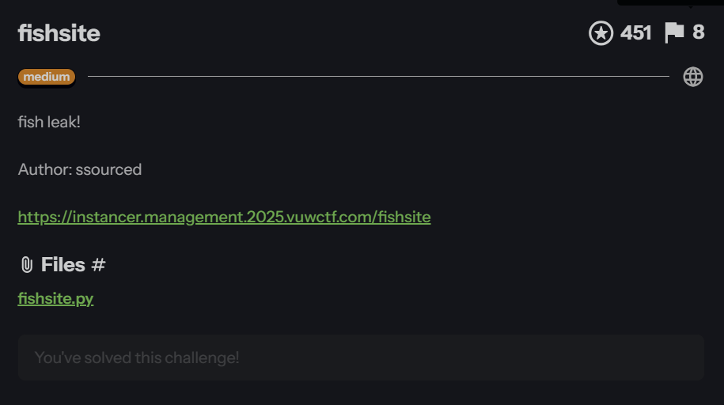
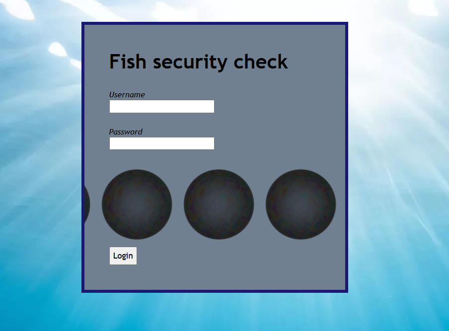
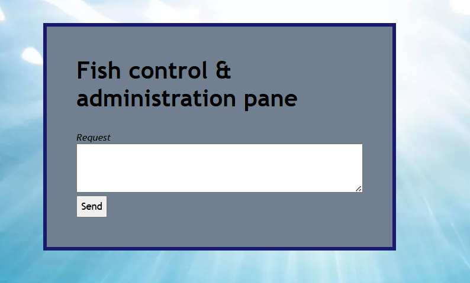
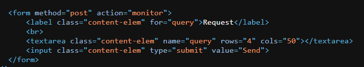
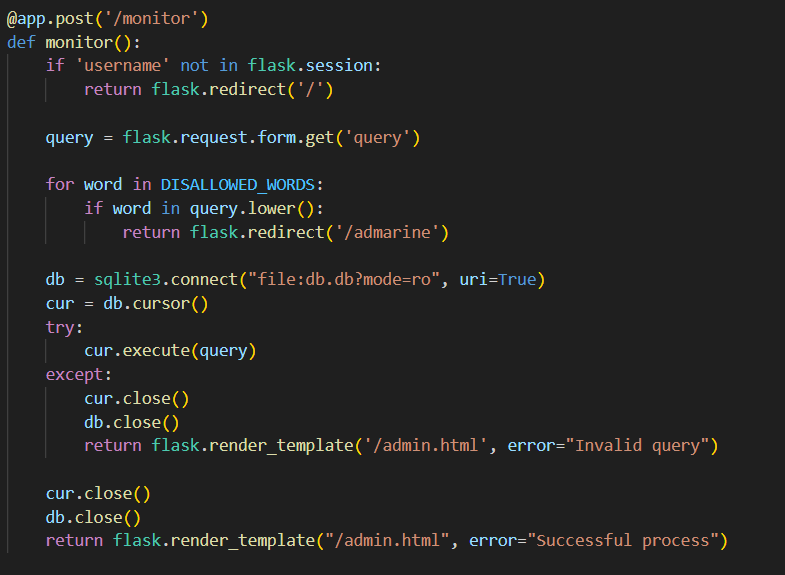
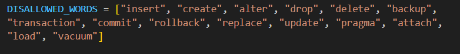
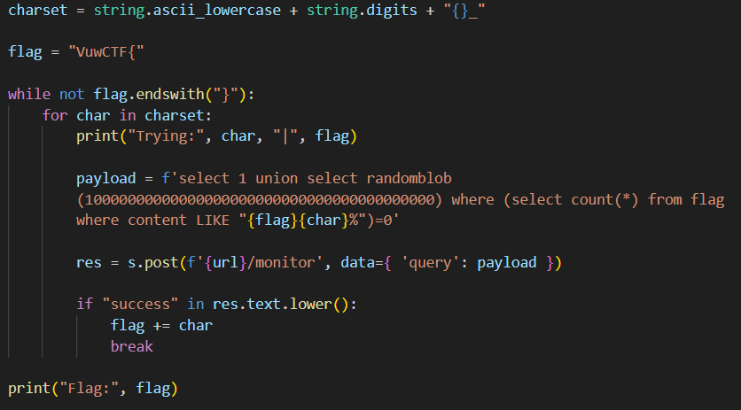

## fishsite



Opening the webpage, we are presented with a login page.  



Looking at the challenge source code, we can see that the `/login` endpoint has a SQLi vulnerability.  


We can use a simple SQLi payload to bypass the authentication check entirely and gain access to the admin panel.   

```
Username: ' or 1--
Password: a
```



On the admin panel, we can see that the form makes a `POST` request to `/monitor`.  



Back in the backend code, `/monitor` allows us to execute arbitrary SQL queries, except that the results aren't rendered on the webpage.  

Instead, either `Successful process` or `Invalid query` is rendered. Essentially, we are forced to do error-based SQLi.  



The endpoint also enforces a simple blacklist.  



In a Hail Mary attempt, I was able to guess the `flag` table and its column name.  

This meant that the `content` column in `flag` most likely contained the flag.  

```
SELECT content from flag
```

Our payload will attempt to match the `content` column character by character. If the match fails, the payload will throw an error, allowing us to determine if our character guess was correct.  

```sql
select 1 union select <error> where (select count(*) from flag where content LIKE "v%")=0
```

Since `load_extension()` was blacklisted, we can instead throw an error by overflowing the size constraint of `randomblob()`.  

```sql
randomblob(10000000000000000000000000000000000000000)
```

With this knowledge, we can write a script to bruteforce the flag character by character.  



Flag: `VuwCTF{h3art_0v_p3ar1}`