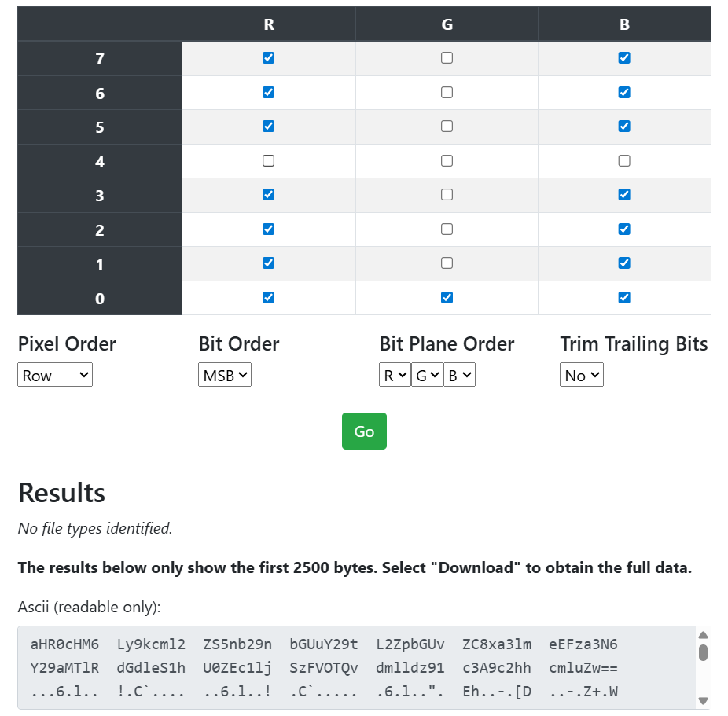
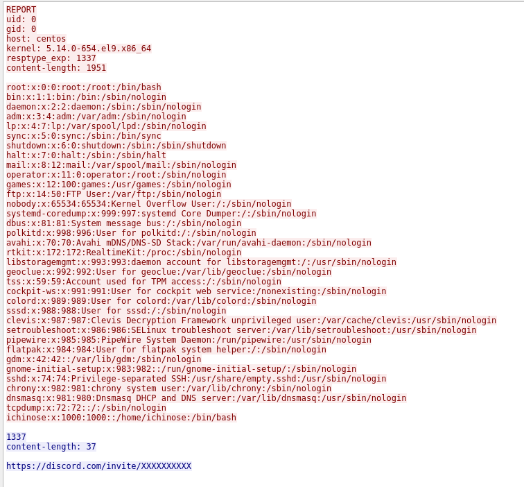
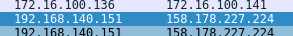
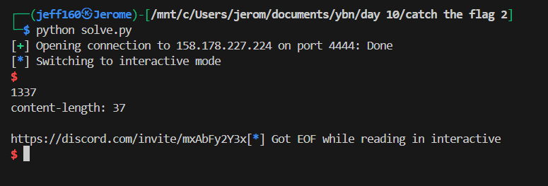
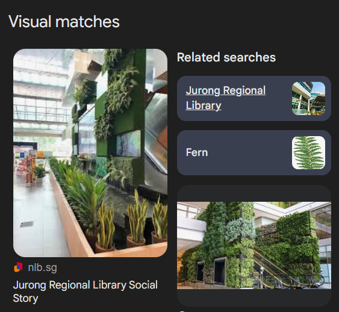

## Catch the Flag 2  

This challenge requires us to figure out and go to the admins' physical location to get the flag. We are provided with only an image to analyse.  

Opening the image in aperisolve, we can notice that some of the bit planes have a recurring pattern in the top left corner-a thin line of pixels.  

In [StegOnline](https://georgeom.net/StegOnline/extract), we can select only the rows with the pattern and extract data from them. This will produce a Base64 string that decodes to `https://drive.google.com/file/d/1kyfxAskszcoZ19Qtgey-aSFDsYcK1U94/view?usp=sharing`.  

The drive link will lead us to a `.pcapng` file that we can open in Wireshark.  

One of the TCP packets appears to have ran shell commands on a vulnerable machine, which caused it to output a discord invite link, although redacted.  

The packet includes the vulnerable machine's IP address, so we can 

We can use Python to send over the exact same payload, which will get the server to return the unredacted discord link.  

In the server, there is a `locations` channels that contains photos of the admins' current locations.  

A Google Lens search on the West location will lead us to Jurong Regional Library.  

Flag: `YBN25{pE@NUT5_fOR_f1Nd!n6_U5}`