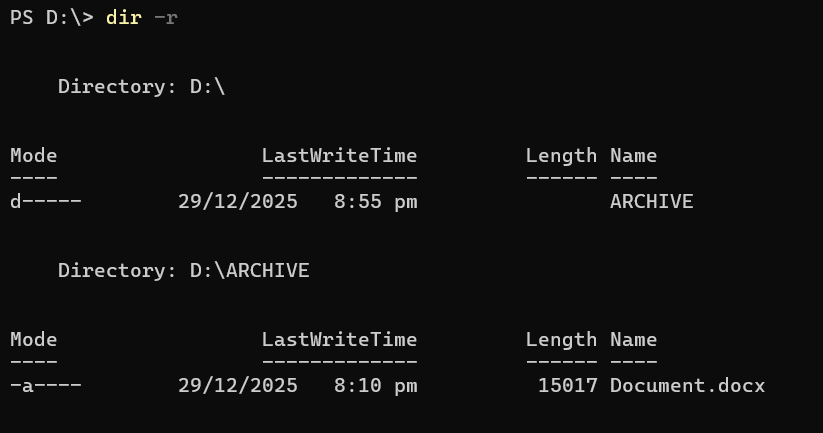
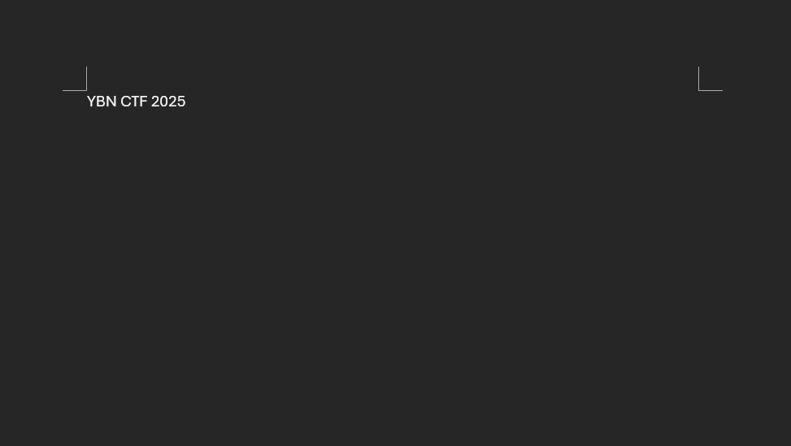

## Another Data Store  


In this challenge, we are provided with a disk image to analyse. We can first mount the disk image using [OSFMount](https://www.osforensics.com/tools/mount-disk-images.html).  

Inside, we can find a folder `Archive` with a word document inside.  



At first glance, the document appears uninteresting, with just one line of text and no other info.  



Since word documents are essentially zip files, we can add a `.zip` extension to `Document.docx`.  

We can then find ``L47E{IL8|0}9I$nSG'/c`*aa`` enclosed within the `<cp:keywords>` tags, and this looks suspiciously like an AES key.  

```xml
<?xml version="1.0" encoding="UTF-8" standalone="yes"?>
<cp:coreProperties xmlns:cp="http://schemas.openxmlformats.org/package/2006/metadata/core-properties" xmlns:dc="http://purl.org/dc/elements/1.1/" xmlns:dcterms="http://purl.org/dc/terms/" xmlns:dcmitype="http://purl.org/dc/dcmitype/" xmlns:xsi="http://www.w3.org/2001/XMLSchema-instance"><dc:title></dc:title><dc:subject></dc:subject><dc:creator>YBN</dc:creator><cp:keywords>L47E{IL8|0}9I$nSG'/c`*aa</cp:keywords><dc:description></dc:description><cp:lastModifiedBy>Lucius Chee</cp:lastModifiedBy><cp:revision>8</cp:revision><dcterms:created xsi:type="dcterms:W3CDTF">2025-12-20T04:23:00Z</dcterms:created><dcterms:modified xsi:type="dcterms:W3CDTF">2025-12-29T12:06:00Z</dcterms:modified></cp:coreProperties>
```

However, since we don't have the ciphertext, we don't actually have anything to decrypt the key with.  

Going back into the disk image, running [`streams`](https://learn.microsoft.com/en-us/sysinternals/downloads/streams) on the word document actually shows a hidden stream `Flag` in `Document.docx`, which we can then read with `more`, giving us a Base64 string.  


In [CyberChef](https://gchq.github.io/CyberChef/), we can Base64 decode the cipher, then AES ECB decrypt it with the key we found earlier, giving us the flag.  


Flag: `YBN25{NTF$_A1t3RnAt3_D4ta_$tr3am$_1989138894}`