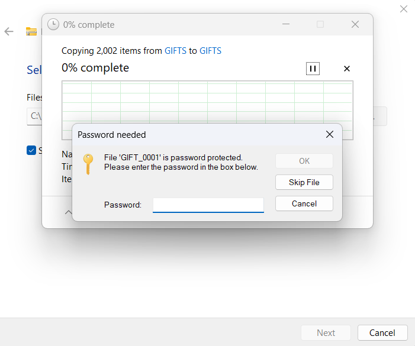
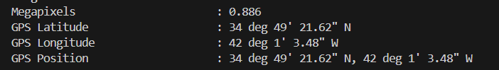
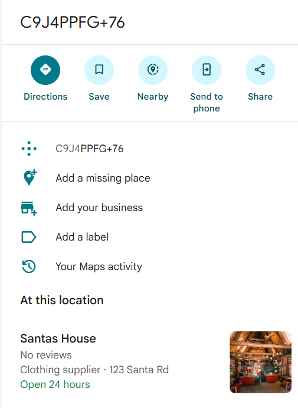

## Message from the Pole  


We are provided with a large zip file that is password protected.  



We can first extract the password hash using `zip2john`. Note that we just need to extract the part of the hash from `$pkzip$` to `$/pkzip$`.  

```bash
zip2john GIFTS.zip > hash.txt
```

After that, we can bruteforce the password using `rockyou.txt`, revealing the password to be `*santa*`.  

```bash
hashcat -m 17225 hash.txt rockyou.txt
hashcat -m 17225 hash.txt --show
```

Running `exiftool` on one of the images reveals GPS coordinates in the image metadata.  



We can extract and store all the GPS coordinates.  

```bash
exiftool -n -GPSLatitude -GPSLongitude -FileName GIFTS/*.jpg > gps.txt
```

We can then write a script to extract the coordinates that only appear once in the file: `82.7232189878222 -37.2744921189639`.  

```python
from collections import defaultdict

coords = defaultdict(list)

with open("gps.txt") as f:
    current_file = None
    lat = lon = None

    for line in f:
        if line.startswith("========"):
            current_file = line.split("/")[-1].strip()
        elif "GPS Latitude" in line:
            lat = float(line.split(":")[1])
        elif "GPS Longitude" in line:
            lon = float(line.split(":")[1])
            coords[(lat, lon)].append(current_file)

for (lat, lon), files in coords.items():
    if len(files) == 1:
        print(lat, lon)
```

Searching for the location in Google Maps shows `C9J4PPFG+76`, which is a Google Plus Code representing a very precise location.  


Searching for `C9J4PPFG+76` then leads us to a location called `Santas House`, giving us our flag.  



Flag: `YBN25{santas_house}`