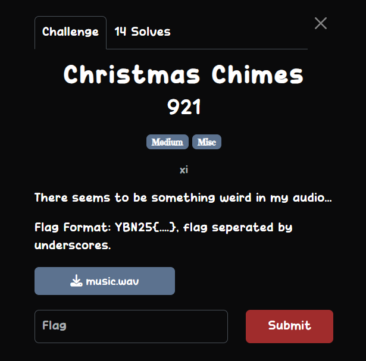
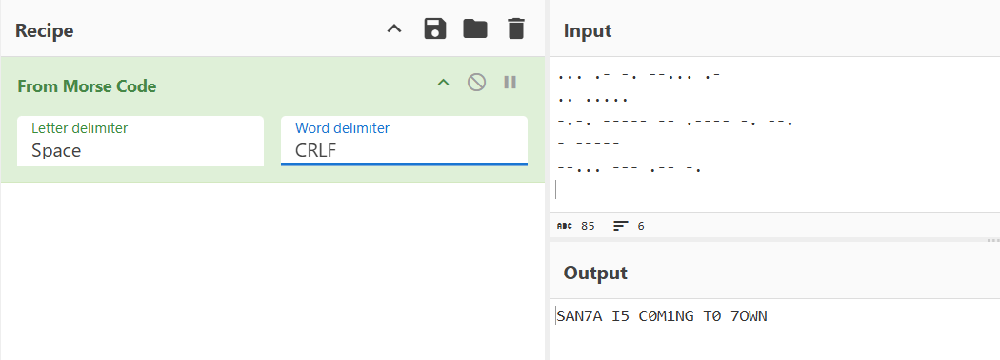

## Christmas Chimes  

We are provided with a `.wav` file to analyse. Viewing the spectrogram in Audacity reveals many lines of binary at the end of the audio.  

This is hella tedious but we can just copy all the binary strings. Decoding all the binary chunks gives us a long string mainly composed of just `jingle` and `bell`.  

This is actually morse code, where `jingle` and `bell` correspond to `.` and `-` respectively, and `/` separates each word.  

We can write a Python script to do the conversion, then decode the morse code using Cyberchef, giving us the flag text.  

Flag: `YBN25{SAN7A_I5_C0M1NG_T0_7OWN}`