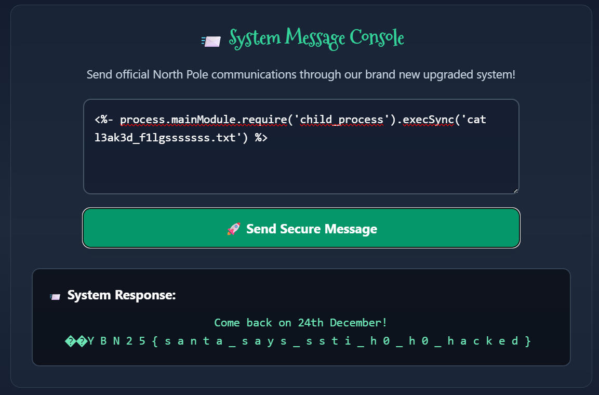

## Mainframe Upgraded?


We are given an improved version of the webpage from the guided SSTI chall.  


The challenge description hints at this still being an SSTI chall, and the message on the webpage hints at Node.js SSTI.  

We can test for SSTI with a simple Node.js template injection payload.  


We can easily get RCE and inspect the directory structure with this payload.  

```js
<%- process.mainModule.require('child_process').execSync('ls') %>
```


We can read just read the flag file to get the flag. The characters of the flag are prepended with null bytes but you can just remove those with Python.  



Flag: `YBN25{santa_says_ssti_h0_h0_hacked}`