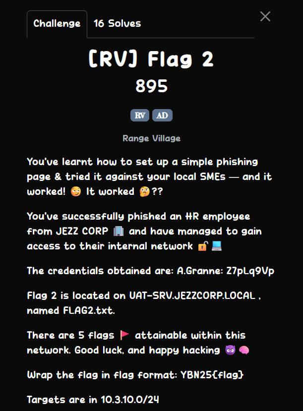
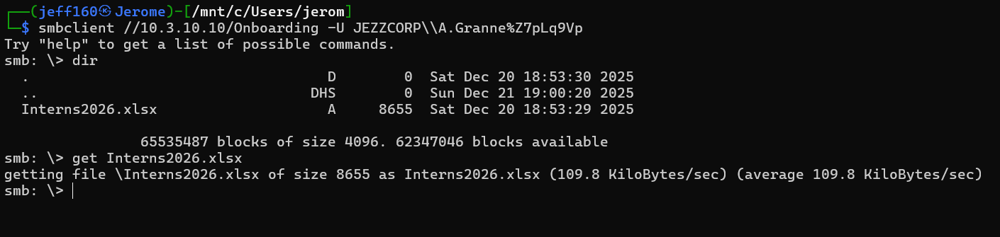
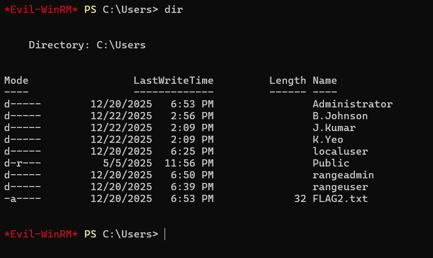

## [RV] Flag 2



Using `smbclient`, we can see that the provided credentials has access to an `Onboarding` share.  


In the share, we can find a `Interns2026.xlsx` file.  



This file actually contains the credentials of some interns.  


We can use one of the intern's credentials to connect to the Windows machine on `.20`.  

```bash 
evil-winrm -i 10.3.10.20 -u 'JEZZCORP\J.Kumar' -p Z7pLr2Qa
```

We can then `cd` into `/Users` to get flag 2.  



Flag: `YBN25{1095744decaa363007c1d480b6d22759}`