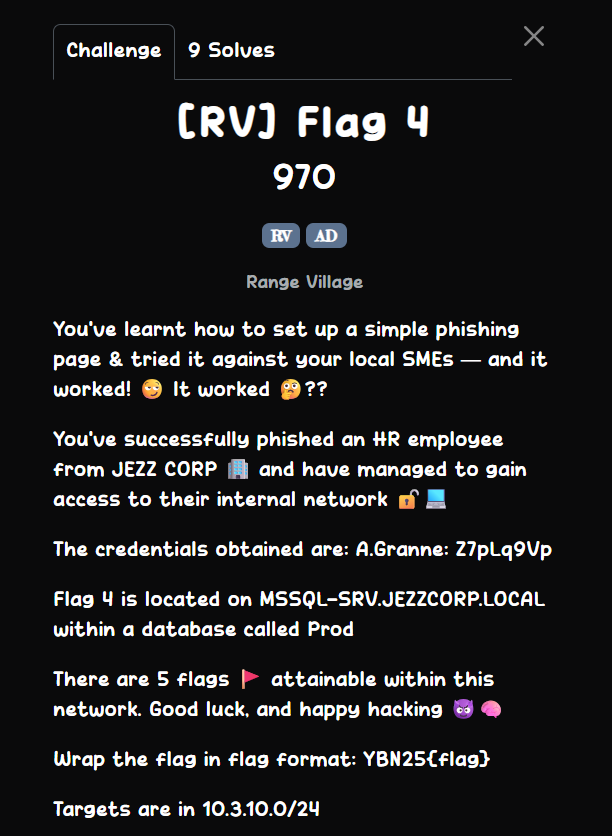
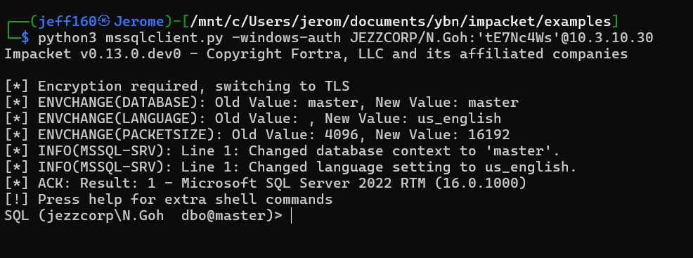
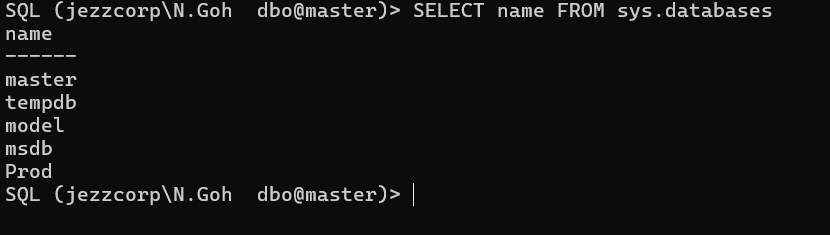

## [RV] Flag 4  



The challenge description directs us towards finding a database on the network.  

In the FLAG3 machine, we can find the database described, as well as as log file.  


The log file shows a failed connection attempt by the user `N.Goh`, meaning we have to find his credentials to access the MSSQL database.  

```
2025-12-22 15:33:51 - ===== Starting backup for Prod =====
2025-12-22 15:33:51 - Connecting to SQL server 'MSSQL-SRV.JEZZCORP.LOCAL' using N.Goh@JEZZCORP.LOCAL
2025-12-22 15:33:51 - ERROR: Could not load file or assembly 'Microsoft.SqlServer.Smo, Version=9.0.242.0, Culture=neutral, PublicKeyToken=89845dcd8080cc91' or one of its dependencies. The system cannot find the file specified.
```

In `/Scripts/Backup`, we can find yet another suspicious looking powershell script.  


Inside, we can find the credentials for `N.Goh`.  

```powershell
...
# ===========================
# Configuration
# ===========================

$Username        = "N.Goh@JEZZCORP.LOCAL"
$Password        = "tE7Nc4Ws"   # DO NOT SHARE
$ServerName      = "MSSQL-SRV.JEZZCORP.LOCAL"
$DatabaseName    = "Prod"
$BackupRoot      = "C:\DBBackups\Prod"
$LogFile         = "C:\DBBackups\BackupProd.log"
...
```

Using the `Impacket` MSSQL client script, we can connect ot the database using the credentials we found.  



Inside, we can find the exact database `Prod` from the challenge description.  



We can find the `FLAG4` table inside `Prod`, which will contain the flag.  


Flag: `YBN25{f79e3ea568a18c520785d1f197d89a59}`