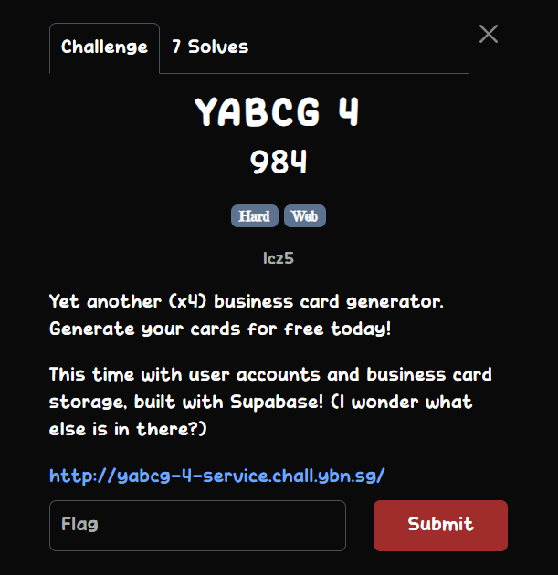
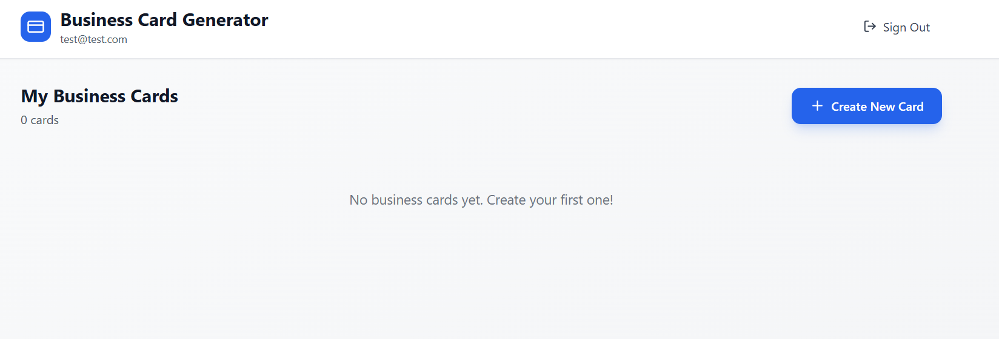
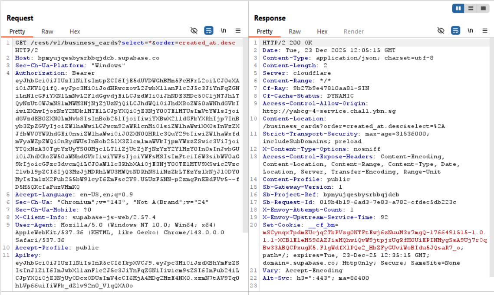
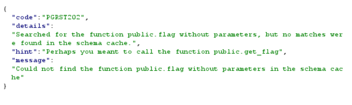

## YABCG 4  

We are given a website for business card generation. The challenge description states that the website uses Supabase for storage.  

In Burpsuite, we can intercept a request that reveals a `SELECT` query to the database for displaying the business cards.    

The request contains the database API key and the project ID, which are just what we need to send queries to the database.  

The Supabase REST API has a `/rpc` endpoint, which gives access to user-defined functions. 

The cool thing about Supabase is that if you enter an incorrect table or endpoint, the server response will suggest the next closest existing name.  

Here, the server hints the correct name of the table when querying `business` instead of `business_cards`.  

I tried searching `/rpc` for a function with `flag` in the name by querying `/rest/v1/rpc/flag`.  

The server response hint revealed that there was indeed a function `get_flag` defined in the RPC.  

Making a `GET` request to `/rest/v1/rpc/get_flag` will then return the flag.  

Flag: `YBN25{L6g5RC2ZD5VNNong5OjJ}`