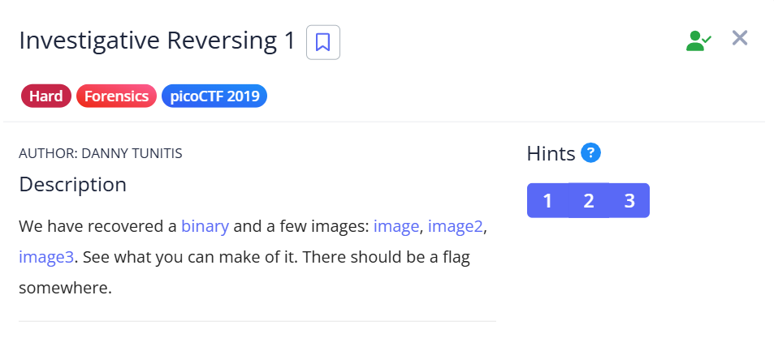

## Investigative Reversing 1  



basically the binary takes a `26` bytes flag and encrypts some of the indexes, then splits up the flag between the image files  

just get gpt to diff ts lol  

```c
void main(void)
{
  FILE *__stream;
  FILE *__stream_00;
  FILE *__stream_01;
  FILE *__stream_02;
  long in_FS_OFFSET;
  char local_6b;
  int local_68;
  int local_64;
  int local_60;
  char local_38 [4];
  char local_34;
  char local_33;
  long local_10;
  
  local_10 = *(long *)(in_FS_OFFSET + 0x28);
  __stream = fopen("flag.txt","r");
  __stream_00 = fopen("mystery.png","a");
  __stream_01 = fopen("mystery2.png","a");
  __stream_02 = fopen("mystery3.png","a");
  if (__stream == (FILE *)0x0) {
    puts("No flag found, please make sure this is run on the server");
  }
  if (__stream_00 == (FILE *)0x0) {
    puts("mystery.png is missing, please run this on the server");
  }
  fread(local_38,0x1a,1,__stream);
  fputc((int)local_38[1],__stream_02);
  fputc((int)(char)(local_38[0] + '\x15'),__stream_01);
  fputc((int)local_38[2],__stream_02);
  local_6b = local_38[3];
  fputc((int)local_33,__stream_02);
  fputc((int)local_34,__stream_00);
  for (local_68 = 6; local_68 < 10; local_68 = local_68 + 1) {
    local_6b = local_6b + '\x01';
    fputc((int)local_38[local_68],__stream_00);
  }
  fputc((int)local_6b,__stream_01);
  for (local_64 = 10; local_64 < 0xf; local_64 = local_64 + 1) {
    fputc((int)local_38[local_64],__stream_02);
  }
  for (local_60 = 0xf; local_60 < 0x1a; local_60 = local_60 + 1) {
    fputc((int)local_38[local_60],__stream_00);
  }
  fclose(__stream_00);
  fclose(__stream);
  if (local_10 != *(long *)(in_FS_OFFSET + 0x28)) {
                    /* WARNING: Subroutine does not return */
    __stack_chk_fail();
  }
  return;
}
```

Flag: `picoCTF{An0tha_1_b044e3b4}`