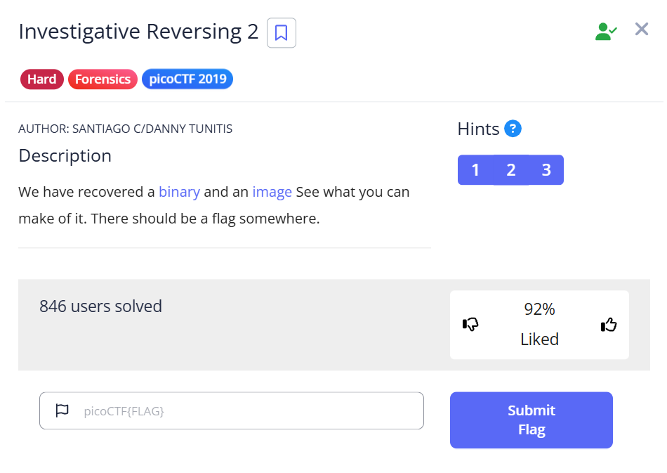

## Investigative Reversing 2  



binary just hides the flag in the image with lsb stego  

just get gpt to diff ts  

```c
undefined8 main(void)
{
  size_t sVar1;
  long in_FS_OFFSET;
  char local_7e;
  char local_7d;
  int local_7c;
  int local_78;
  int local_74;
  int local_70;
  undefined4 local_6c;
  int local_68;
  int local_64;
  FILE *local_60;
  FILE *local_58;
  FILE *local_50;
  char local_48 [56];
  long local_10;
  
  local_10 = *(long *)(in_FS_OFFSET + 0x28);
  local_6c = 0;
  local_60 = fopen("flag.txt","r");
  local_58 = fopen("original.bmp","r");
  local_50 = fopen("encoded.bmp","a");
  if (local_60 == (FILE *)0x0) {
    puts("No flag found, please make sure this is run on the server");
  }
  if (local_58 == (FILE *)0x0) {
    puts("original.bmp is missing, please run this on the server");
  }
  sVar1 = fread(&local_7e,1,1,local_58);
  local_7c = (int)sVar1;
  local_68 = 2000;
  for (local_78 = 0; local_78 < local_68; local_78 = local_78 + 1) {
    fputc((int)local_7e,local_50);
    sVar1 = fread(&local_7e,1,1,local_58);
    local_7c = (int)sVar1;
  }
  sVar1 = fread(local_48,0x32,1,local_60);
  local_64 = (int)sVar1;
  if (local_64 < 1) {
    puts("flag is not 50 chars");
                    /* WARNING: Subroutine does not return */
    exit(0);
  }
  for (local_74 = 0; local_74 < 0x32; local_74 = local_74 + 1) {
    for (local_70 = 0; local_70 < 8; local_70 = local_70 + 1) {
      local_7d = codedChar(local_70,(int)(char)(local_48[local_74] + -5),(int)local_7e);
      fputc((int)local_7d,local_50);
      fread(&local_7e,1,1,local_58);
    }
  }
  while (local_7c == 1) {
    fputc((int)local_7e,local_50);
    sVar1 = fread(&local_7e,1,1,local_58);
    local_7c = (int)sVar1;
  }
  fclose(local_50);
  fclose(local_58);
  fclose(local_60);
  if (local_10 == *(long *)(in_FS_OFFSET + 0x28)) {
    return 0;
  }
                    /* WARNING: Subroutine does not return */
  __stack_chk_fail();
}


byte codedChar(int param_1,byte param_2,byte param_3)
{
  undefined1 local_20;
  
  local_20 = param_2;
  if (param_1 != 0) {
    local_20 = (byte)((int)(char)param_2 >> ((byte)param_1 & 0x1f));
  }
  return param_3 & 0xfe | local_20 & 1;
}
```

Flag: `picoCTF{n3xt_0n3000000000000000000000000009d2c9df}`