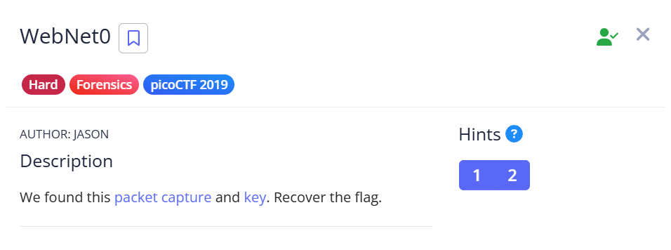
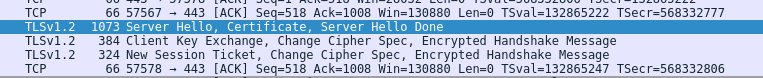
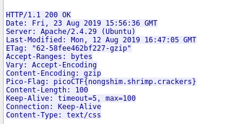

## WebNet0  

We are provided with a private RSA key and a packet capture.  

In Wireshark, we can find some packets that show a client key exchange.  

We can import the private key file into Wireshark protocol preferences, then follow the TLS stream of the packet. The TLS stream will be decoded, displaying the flag in the request headers.  

Flag: `picoCTF{nongshim.shrimp.crackers}`