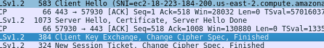
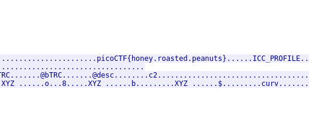

Just like in WebNet0, we are provided with a packet capture and private RSA key file.  

In the packet capture, we can find the client key exchange packet.  

Importing the private key and following the TLS stream of the packet will reveal a JPEG image, which will contain the flag in the image bytes.  

Flag: `picoCTF{honey.roasted.peanuts}`